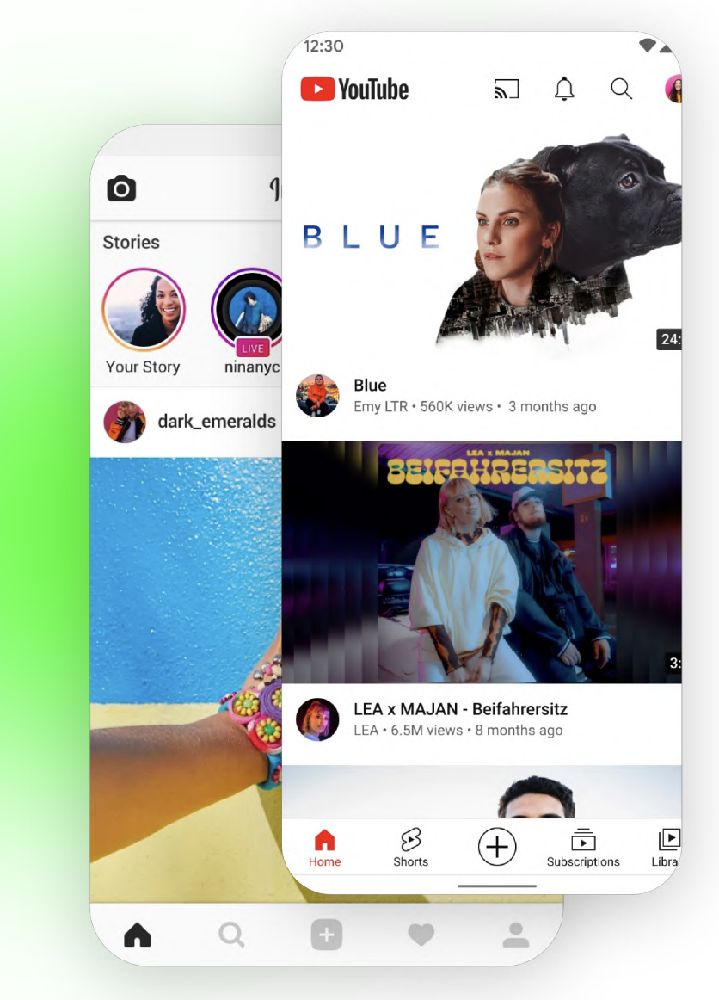

# Bottom Navigation View



https://material.io/components/bottom-navigation/android

Otro de los componentes que vemos en muchas apps  es el de BottomNavigationView, que es como una
barra de navegación con pestañas situada debajo de la pantalla.

Este componente se parece mucho al TabLayout, pero funcionan ligeramente diferente.

## Implementación

### Implementación 1/3

El siguiente código corresponde al componente en sí, habría que añadirlo en un fragment o bien en 
un activity

```xml
<?xml version="1.0" encoding="utf-8"?>
<RelativeLayout xmlns:android="http://schemas.android.com/apk/res/android"
    xmlns:app="http://schemas.android.com/apk/res-auto"
    xmlns:tools="http://schemas.android.com/tools"
    android:layout_width="match_parent"
    android:layout_height="match_parent"
    tools:context=".MainActivity">

    <FrameLayout
        android:id="@+id/main_container"
        android:layout_width="match_parent"
        android:layout_height="match_parent"
        android:layout_above="@+id/bottom_navigation_view"
        android:layout_marginBottom="10dp"
        />

    <com.google.android.material.bottomnavigation.BottomNavigationView
        android:id="@+id/bottom_navigation_view"
        android:layout_width="match_parent"
        android:layout_height="wrap_content"
        android:layout_alignParentBottom="true"
        android:layout_marginBottom="0dp"
        app:menu="@menu/bottom_navigation_menu"
        />

</RelativeLayout>
```

### Implementación 2/3

A continuación, hay que crear un recurso layout de tipo menu

The @menu/bottom_navigation_menu resource should point to a file named bottom_navigation_menu.xml 
inside a menu resource directory:

```xml
<?xml version="1.0" encoding="utf-8"?>
<menu xmlns:android="http://schemas.android.com/apk/res/android">
    <item
        android:id="@+id/page_1"
        android:enabled="true"
        android:icon="@drawable/ic_baseline_bookmark_border_24"
        android:title="Opción 1"/>
    <item
        android:id="@+id/page_2"
        android:enabled="true"
        android:icon="@drawable/ic_baseline_bookmark_border_24"
        android:title="opción 2"/>
</menu>
```

Note: BottomNavigationView does not support more than 5 menu items.


### Implementación 3/3

Por último, faltaría cambiar el componente en la activity o fragment

```kotlin

class MainActivity : AppCompatActivity() {
    override fun onCreate(savedInstanceState: Bundle?) {
        super.onCreate(savedInstanceState)
        setContentView(R.layout.activity_main)

        val bottom_navigation_view = findViewById<BottomNavigationView>(R.id.bottom_navigation_view)

        bottom_navigation_view.setOnItemSelectedListener { menuItem ->
            when(menuItem.itemId) {
                R.id.action_music -> {
                    goToFragment(MusicFragment())
                    true
                }
                R.id.action_films -> {
                    goToFragment(FilmsFragment())
                    true
                }
                R.id.action_books -> {
                    goToFragment(BooksFragment())
                    true
                }
                else -> false
            }
        }
        bottom_navigation_view.selectedItemId = R.id.action_music
    }

    fun goToFragment(fragment: Fragment) {
        supportFragmentManager.beginTransaction().replace(R.id.main_container, fragment).commit()
    }

    // childFragmentmanager.beginTransaction().replace(R.id.main_container, f).commit()
    // Para implementarlo en un Fragment en lugar de en un activity
}
```